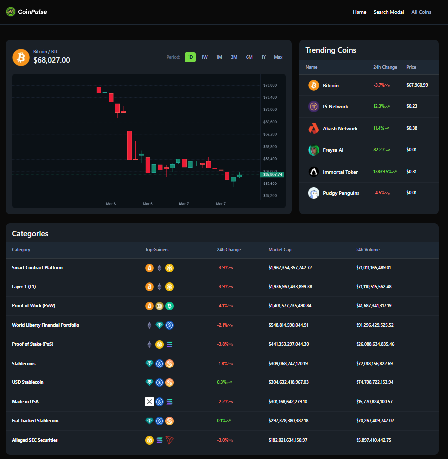
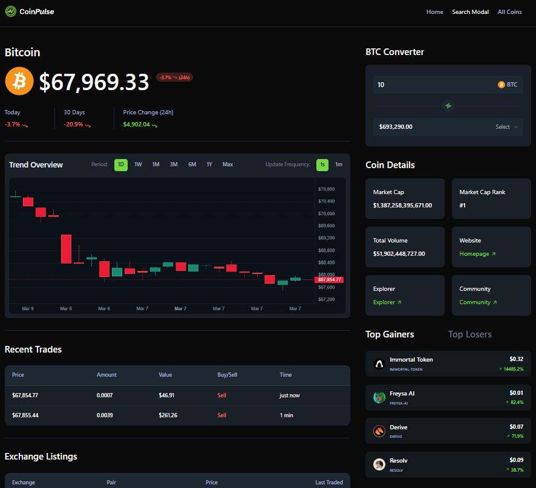
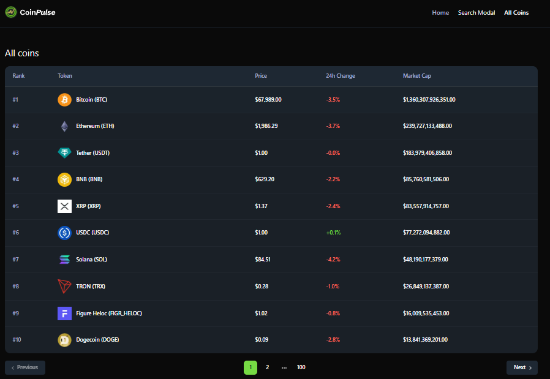
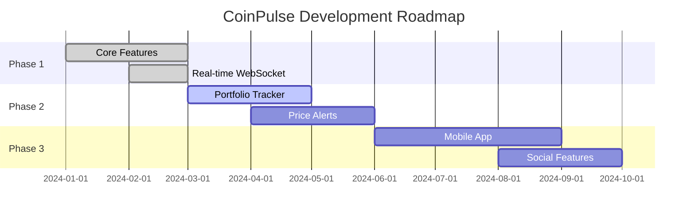

<div align="center">

<!-- Animated Header -->


<!-- Badges Row 1 - Status -->
[](https://github.com/i-dont-know-45/coinpulse/actions)
[](https://github.com/i-dont-know-45/coinpulse/releases)
[](CONTRIBUTING.md)

<!-- Badges Row 2 - Tech Stack -->
[](https://nextjs.org/)
[](https://react.dev/)
[](https://www.typescriptlang.org/)
[](https://tailwindcss.com/)

<br/>

<p align="center">
  <strong>🚀 Track cryptocurrency prices, analyze market trends, and monitor live trades — all in one powerful dashboard.</strong>
</p>

<p align="center">
  <a href="#-features">Features</a> •
  <a href="#-quick-preview">Preview</a> •
  <a href="#-tech-stack">Tech Stack</a> •
  <a href="#-installation">Installation</a> •
  <a href="#-screenshots">Screenshots</a> •
  <a href="#-roadmap">Roadmap</a>
</p>

<!-- Animated Line -->


</div>

## 💡 Why CoinPulse?

<div align="center">

```
┌─────────────────────────────────────────────────────────────────────────────┐
│                                                                             │
│   REAL-TIME DATA        │   PRO CHARTS            │   SECURE                │
│   WebSocket-powered     │   TradingView quality   │   No data stored        │
│   instant updates       │   candlestick charts    │   locally               │
│                                                                             │
│   ACCURATE              │   DARK MODE             │   RESPONSIVE            │
│   CoinGecko Pro API     │   Easy on the eyes      │   Works on any          │
│   trusted data          │   for night trading     │   device                │
│                                                                             │
└─────────────────────────────────────────────────────────────────────────────┘
```

</div>

## 🎥 Quick Preview

<div align="center">

<!-- Replace with your actual demo GIF -->


<br/>

</div>

## ✨ Features

<div align="center">

<table>
<tr>
<td width="50%" align="center">


### 📊 Live Market Data

Real-time price updates via WebSocket<br/>
Live candlestick charts with customizable periods<br/>
Instant trade feed with buy/sell indicators

</td>
<td width="50%" align="center">


### 📈 Advanced Charts

Interactive candlestick charts (Lightweight Charts)<br/>
Multiple timeframes (1H, 24H, 7D, 30D, 1Y)<br/>
Live OHLCV data streaming

</td>
</tr>
<tr>
<td width="50%" align="center">


### 🔄 Currency Converter

Convert crypto to 60+ fiat currencies<br/>
Real-time conversion rates<br/>
Clean, intuitive interface

</td>
<td width="50%" align="center">


### 🏆 Market Overview

Trending coins tracker<br/>
Top gainers & losers<br/>
Category-wise market analysis

</td>
</tr>
</table>

</div>

### 🎯 All Features at a Glance

```diff
+ ✅ Real-time WebSocket price updates
+ ✅ Professional candlestick charts
+ ✅ Live trade feed monitoring
+ ✅ Multi-currency converter (60+ currencies)
+ ✅ Trending coins & categories
+ ✅ Top gainers & losers tracking
+ ✅ Responsive dark-mode UI
+ ✅ Server-side rendering for SEO
+ ✅ TypeScript for type safety
+ ✅ Modern React 19 features
```

## 🛠 Tech Stack

<div align="center">

| Category | Technologies |
|----------|-------------|
| **Framework** |   |
| **Language** |  |
| **Styling** |  |
| **UI Components** |   |
| **Charts** |  |
| **API** |  |
| **Real-time** |  |

</div>

## 📦 Installation

### Prerequisites

- Node.js 18+ 
- npm, yarn, or pnpm
- CoinGecko API Key (Pro for WebSocket features)

### Quick Start

```bash
# Clone the repository
git clone https://github.com/i-dont-know-45/coinpulse.git
cd coinpulse

# Install dependencies
npm install

# Set up environment variables
cp .env.example .env.local
```

### Environment Variables

Create a `.env.local` file in the root directory:

```env
NEXT_PUBLIC_COINGECKO_API_URL=https://pro-api.coingecko.com/api/v3
NEXT_PUBLIC_COINGECKO_WEBSOCKET_URL=wss://ws.coingecko.com/api/v3
NEXT_PUBLIC_COINGECKO_API_KEY=your_api_key_here
```

### Run the Development Server

```bash
npm run dev
```

Open [http://localhost:3000](http://localhost:3000) in your browser.

## 📸 Screenshots

<div align="center">

### 🏠 Dashboard


<br/><br/>

### 📊 Coin Details & Live Charts


<br/><br/>

### 📋 All Coins List


</div>

## 📁 Project Structure

```
coinpulse/
├── 📂 app/
│   ├── 📄 page.tsx          # Home dashboard
│   ├── 📄 layout.tsx        # Root layout
│   ├── 📄 globals.css       # Global styles
│   └── 📂 coins/
│       ├── 📄 page.tsx      # All coins list
│       └── 📂 [id]/
│           └── 📄 page.tsx  # Coin details page
├── 📂 components/
│   ├── 📄 CandleStickChart.tsx
│   ├── 📄 Converter.tsx
│   ├── 📄 DataTable.tsx
│   ├── 📄 LiveDataWrapper.tsx
│   ├── 📂 home/             # Homepage components
│   └── 📂 ui/               # Radix UI components
├── 📂 hooks/
│   └── 📄 useCoinGeckoWebSocket.ts
├── 📂 lib/
│   ├── 📄 utils.ts
│   └── 📂 actions/
│       └── 📄 coingecko.actions.ts
└── 📂 public/
    └── 📄 logo.svg
```

## 🚀 Key Features Breakdown

### Real-Time WebSocket Integration
```typescript
// Live price updates, trade feeds, and OHLCV data
const { price, trades, ohlcv, isConnected } = useCoinGeckoWebSocket({
  coinId,
  poolId,
  liveInterval, // "1s" or "1m"
});
```

### Interactive Candlestick Charts
- Built with [Lightweight Charts](https://tradingview.github.io/lightweight-charts/)
- Supports multiple periods: Daily, Weekly, Monthly, Yearly
- Live OHLCV updates for real-time market visualization

### Responsive Data Tables
- Server-side pagination
- Sortable columns
- Mobile-friendly design

## 🗺️ Roadmap

<div align="center">



</div>

| Status | Milestone | Features |
|:------:|-----------|----------|
| ✅ | **Phase 1 - Foundation** | Dashboard, Charts, Real-time data |
| ✅ | **Phase 2 - Enhancement** | Converter, Categories, Pagination |
| 🚧 | **Phase 3 - Portfolio** | Portfolio tracker, Watchlists |
| 📅 | **Phase 4 - Alerts** | Price alerts, Email notifications |
| 📅 | **Phase 5 - Mobile** | React Native app, Push notifications |
| 📅 | **Phase 6 - Social** | Share portfolios, Community features |

> 💡 Have a feature request? [Open an issue](https://github.com/i-dont-know-45/coinpulse/issues/new?template=feature_request.md)!

## 📊 Project Stats

<div align="center">


<!-- Alternative: GitHub Stats -->


</div>

## 🤝 Contributing

Contributions make the open-source community amazing! Any contributions you make are **greatly appreciated**.

<details>
<summary>📋 <b>Contributing Guidelines</b></summary>

### How to Contribute

1. **Fork** the repository
2. **Clone** your fork: `git clone https://github.com/i-dont-know-45/coinpulse.git`
3. **Create** a branch: `git checkout -b feature/AmazingFeature`
4. **Make** your changes
5. **Test** your changes thoroughly
6. **Commit**: `git commit -m 'Add AmazingFeature'`
7. **Push**: `git push origin feature/AmazingFeature`
8. **Open** a Pull Request

### Commit Convention

We use [Conventional Commits](https://www.conventionalcommits.org/):

```
feat: add new feature
fix: bug fix
docs: documentation changes
style: formatting, no code change
refactor: code restructuring
test: adding tests
chore: maintenance
```

</details>

<a href="https://github.com/i-dont-know-45/coinpulse/graphs/contributors">
  
</a>

## 💖 Support the Project

<div align="center">

If you find CoinPulse helpful, please consider:

[](https://github.com/i-dont-know-45/coinpulse)
[](https://github.com/i-dont-know-45)
[](https://buymeacoffee.com/i-dont-know-45)

</div>

## 🙏 Acknowledgments

<div align="center">

| | | | |
|:---:|:---:|:---:|:---:|
| [](https://www.coingecko.com/) | [](https://www.tradingview.com/) | [](https://www.radix-ui.com/) | [](https://vercel.com/) |
| Crypto API | Charts Library | UI Components | Hosting |

</div>

---

## 👨‍💻 About the Developer

<div align="center">
c


<h3>Piyush</h3>

<p>Passionate developer building real-time web apps with <strong>Next.js</strong>, <strong>React</strong> & <strong>TypeScript</strong>.</p>

[](https://github.com/i-dont-know-45)

<br/>

</div>

---

<div align="center">


<h3>CoinPulse &mdash; Track. Analyze. Trade.</h3>

<p>Made with ❤️ and ☕ by <a href="https://github.com/i-dont-know-45"><strong>Piyush</strong></a></p>

<br/>

[](https://github.com/i-dont-know-45/coinpulse/stargazers)
&nbsp;&nbsp;
[](https://github.com/i-dont-know-45/coinpulse/network/members)
&nbsp;&nbsp;
[](https://github.com/i-dont-know-45/coinpulse/watchers)

<br/>


<br/>

**[⬆ Back to Top](#)**

<br/>


</div>
